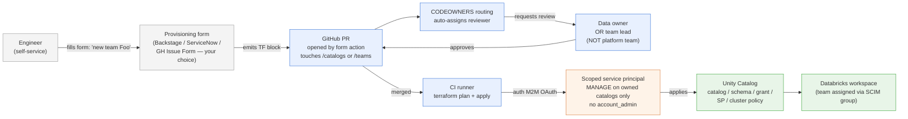
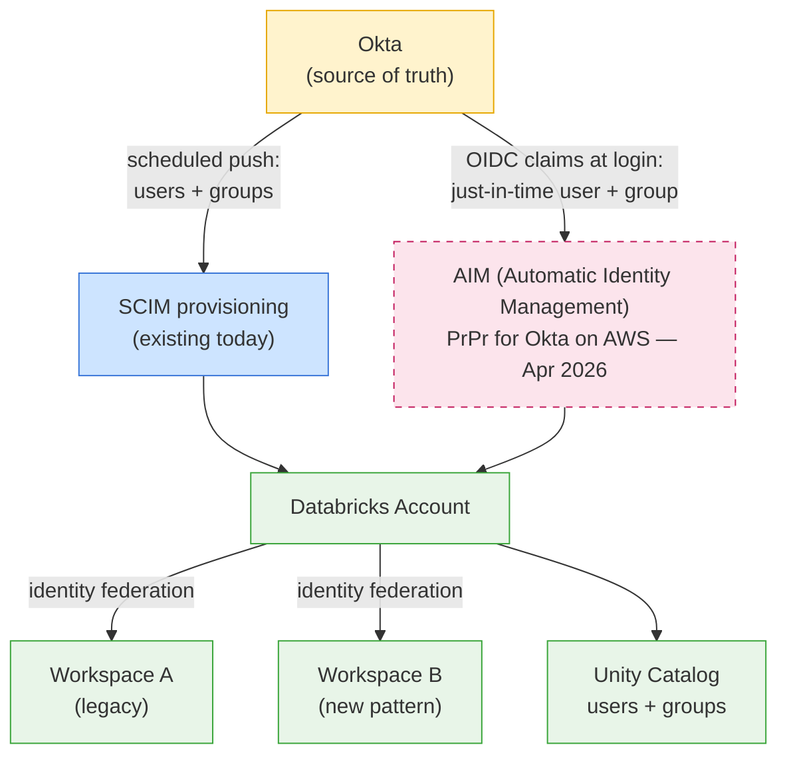

# Reference Architecture — Governed UC Provisioning

## End-state, one picture

**Trust boundaries (numbered, left to right):**
1. **User ↔ form** — auth via corporate SSO, no DBX access from user directly
2. **PR ↔ CODEOWNERS** — GitHub branch protection rules enforce this; no admin override
3. **CI ↔ SP** — short-lived OAuth tokens, SP cannot escalate beyond catalogs it owns
4. **SP ↔ UC** — UC privilege model is the final enforcement layer

The platform team operates **boxes 2 and 3** (the routing config and the SP scope). They do *not* operate boxes 1 (the form) or 4 (UC enforcement) — those are owned by app/security teams and Databricks respectively.

## Identity layer — SCIM and AIM coexistence

**Key decisions to make when adopting this pattern:**

| Decision | Option A (lower risk) | Option B (more upside) |
|----------|----------------------|------------------------|
| **AIM enrollment** | Stay on SCIM-only until Okta AIM goes PuPr | Enroll PrPr now, run AIM + SCIM in parallel, retire SCIM later |
| **Group activation** | Use SCIM `active: true` push for all groups | Use AIM `resolveByExternalId` API to activate JIT |
| **Workspace identity federation** | Account-level (recommended either way) | — |

The dashed/pink box is the PrPr-risk part. **Both SCIM and AIM can coexist on the same account** — they aren't mutually exclusive. The choice is whether to layer AIM in *now* or *post-GA*.

**Common gotcha:**
Enabling AIM with SCIM still pushing causes groups to be created twice (once SCIM-pushed, once OIDC-JIT) under different IDs unless `external_id` is set consistently across both systems.
